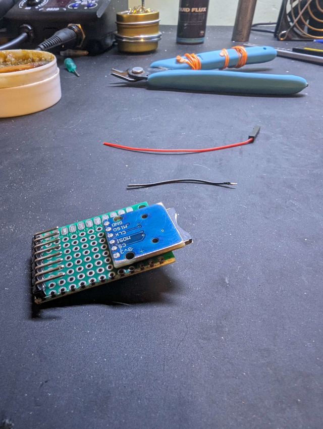
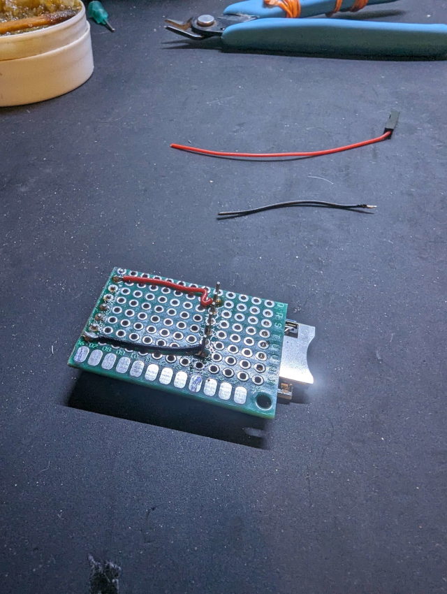
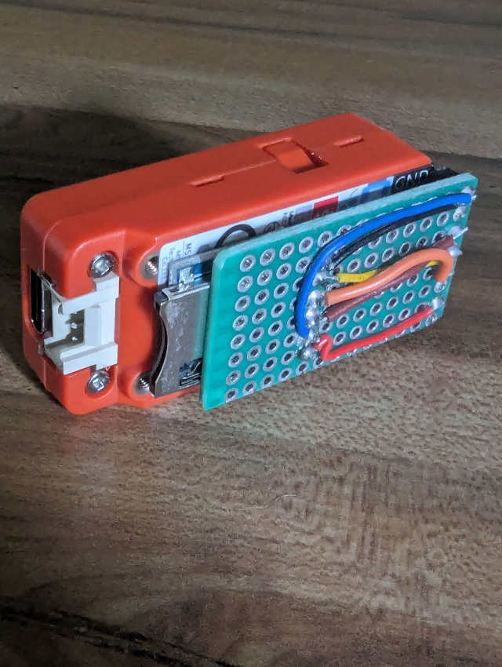
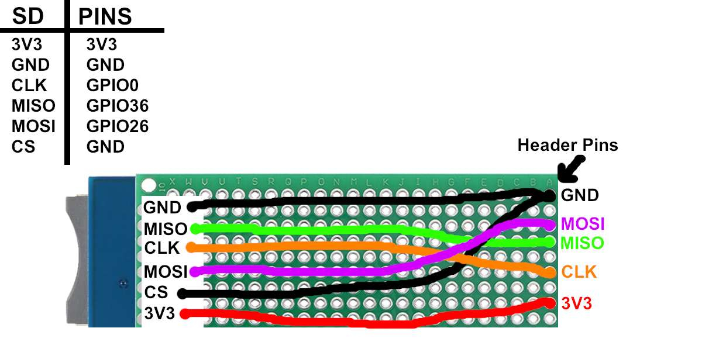

 

## 🌟 M5stick CPlus & CPlus2 SD Backpack 🌟

<b>I've looked around and found very few sd attachments for the  <a href="https://shop.m5stack.com/products/m5stickc-plus-esp32-pico-mini-iot-development-kit">"M5stickC Plus & C Plus2"</a>. So I have built a very simeple one for myself and thought I'd share with the rest of the M5 users.
It's a very easy build and requires a few parts and a soldering iron. Below you'll find directions along with a few images to help you with building this "SD Backpack" as I call it.</b> 
 

<b>I have also designed a case that's a simple print on any 3d printer and takes around 16 mins to print. The STL file can be located <a href="https://github.com/ATOMNFT/M5stick-CPlus-SD-Backpack/blob/main/STL%20File/M5stick%20SD-Backpack%20Case%20V1.stl">HERE</a>.</b>

### Required Items
- Prototyping PCB.
- Micro SD breakout board. (Try to locate the one used in this tut as the larger ones rquire more connections)
- Small wire. (28awg should do)
- LED (this is extra and not needed. But if you use a LED try to find one like referenced)
- Soldering iron & solder.

 

## Pics for guidance  

 

## Wiring Diagram/s

 

