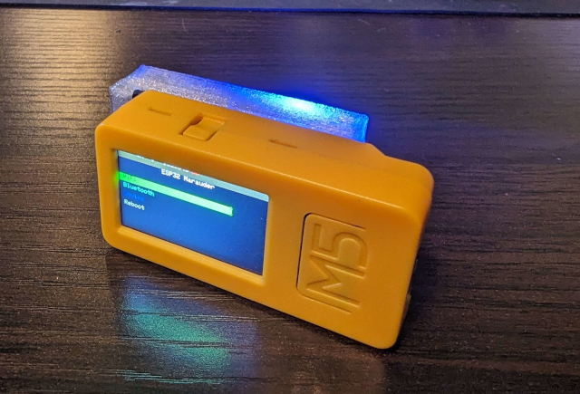
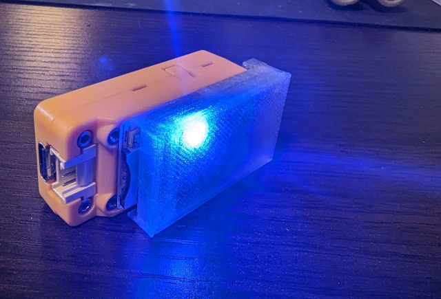
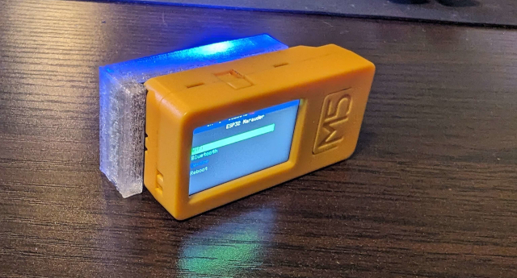
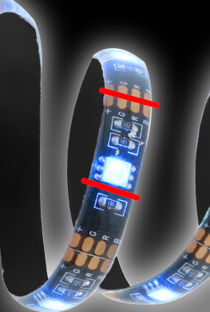
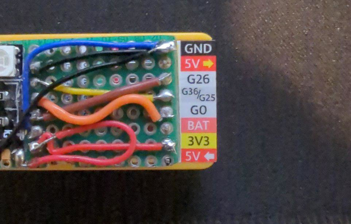
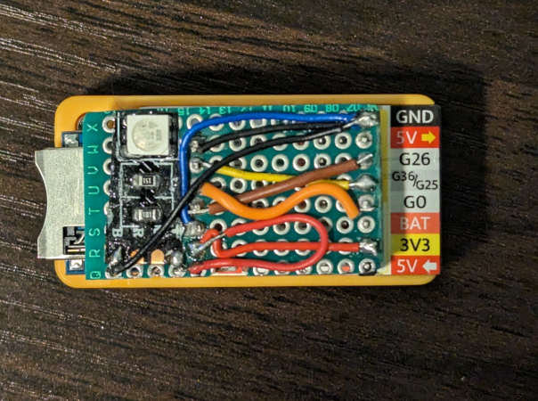
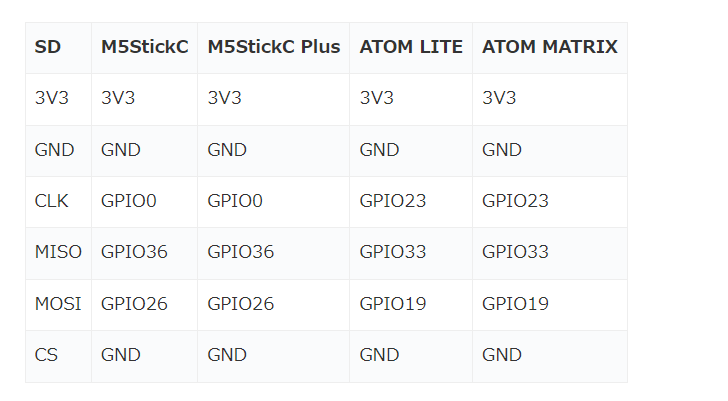

 

  
  

  
---

<h2> 🌟 M5stick CPlus & CPlus2 SD Backpack 🌟 </h2> 

<b>I've looked around and found very few sd attachments for the  <a href="https://shop.m5stack.com/products/m5stickc-plus-esp32-pico-mini-iot-development-kit">"M5stickC Plus & C Plus2"</a>. So I have built a very simeple one for myself and thought I'd share with the rest of the M5 users.
It's a very easy build and requires a few parts and a soldering iron. Below you'll find directions along with a few images to help you with building this "SD Backpack" as I call it.</b> 

 

<b>I have also designed a case that's a simple print on any 3d printer and takes around 16 mins to print. The STL file can be located <a href="https://github.com/ATOMNFT/M5stick-CPlus-SD-Backpack/blob/main/STL%20File/M5stick%20SD-Backpack%20Case%20V1.stl">HERE</a>.</b>

### Required Items
- Prototyping PCB.
- Micro SD breakout board. (Try to locate the one used in this tut as the larger ones require more connections)
- Small wire. (28awg should do)
- LED. This is extra and not needed. But if you use a LED try to find one like <a href="https://monsterilluminessence.com/smartlighting/basics/multi-color-led-light-strip-basics/">THIS</a>
- Soldering iron & solder.

 

## Instructions
<b>Start off by dry fitting the sd breakout and the gpio pins to the pcb of your choice but make sure there is enough room on the prototype pcb to fit all the pins from the sd breakout and gpio pins on the other end.   
Once you have the sd breakout and gpio pins fitted and everything looks good, go ahead and start soldering the sd breakout to the pcb. Then move on to the gpio pins on the other end.  
Once all that is solder on you can start on the wires and their paths. This part is up to you how you you want to run the wires but they must be wired like in the wire diagrams.  
Use the images below as reference. Now, after you have completed soldering all the wires you can trim the remaining pcb around the sd breakout and gpio pins.  
I recommend scoring the pcb and snapping it on the score as this stuff is not good to breath. This trimming part is only need if your board looks like the one in the pic and has extra on the sides.  
You will want to trim it if you want to use the printed case. </b>

### LED Installation

> [!NOTE]
> LED installation is easy and only requires 3v3 and gnd. 
The image below shows where to cut the piece you will need. (+) goes to 3v3 pin and gnd pin goes to the color of your choice.

 

## Pics for guidance & Wiring Diagram/s

📷 Pics for guidance 📷

 

⚡️ Wiring Diagram/s ⚡️

 

